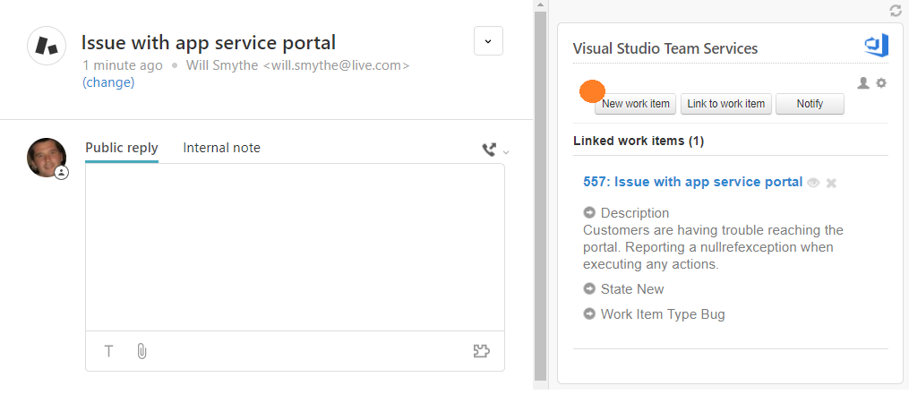

# DevOps App for Zendesk

> Get the [latest version](https://github.com/CieloCosta/devops-zendesk-app/releases) of the app

Unite your customer support and development teams. Quickly create or link work items to tickets, enable efficient two-way communication, and stop using email to check status.

> This is a fork of [https://github.com/Microsoft/vsts-zendesk-app](https://github.com/Microsoft/vsts-zendesk-app)

### Create work items for your engineers right from Zendesk

With the DevOps app for Zendesk, users in Zendesk can quickly create a new work item from a Zendesk ticket.

### Get instant access to the status of linked work items

Give your customer support team easy access to the information they need. See details about work items linked to a Zendesk ticket.

## How to install and setup

### Install the app to Zendesk

1. [Download the latest release](https://github.com/CieloCosta/DevOps-zendesk-app/releases) .zip file
1. From Zendesk, click the settings icon (gear)
1. Under **Apps** click Manage.
1. Click **Upload private app**
1. Give the app a name.
1. Browse to the location you saved the .zip release and select it.
1. Provide your Visual Studio Team Services name and decide on a work item tag for Zendesk.

See [full instructions](https://www.visualstudio.com/docs/marketplace/integrate/service-hooks/services/zendesk)

### Send updates from Visual Studio Team Services to Zendesk

1. Open the admin page for the team project in DevOps
2. On the *Service Hooks* tab, run the subscription wizard
3. Select Zendesk from the subscription wizard
4. Pick and the Visual Studio Team Services event which will post to Zendesk
5. Tell Zendesk what to do when the event occurs
6. Test the service hook subscription and finish the wizard
